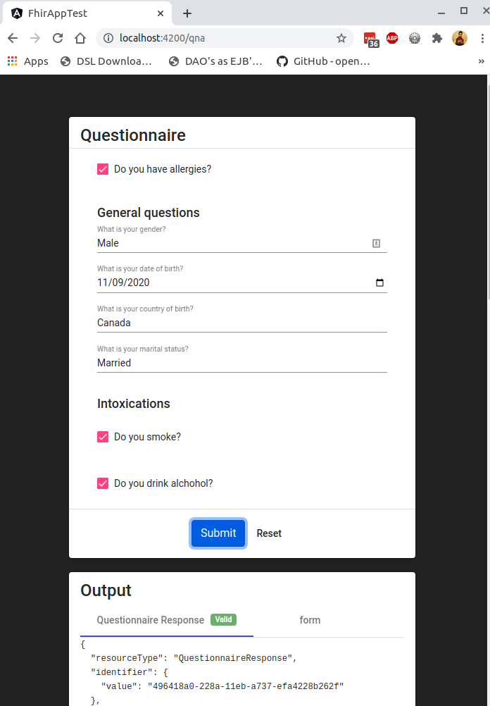
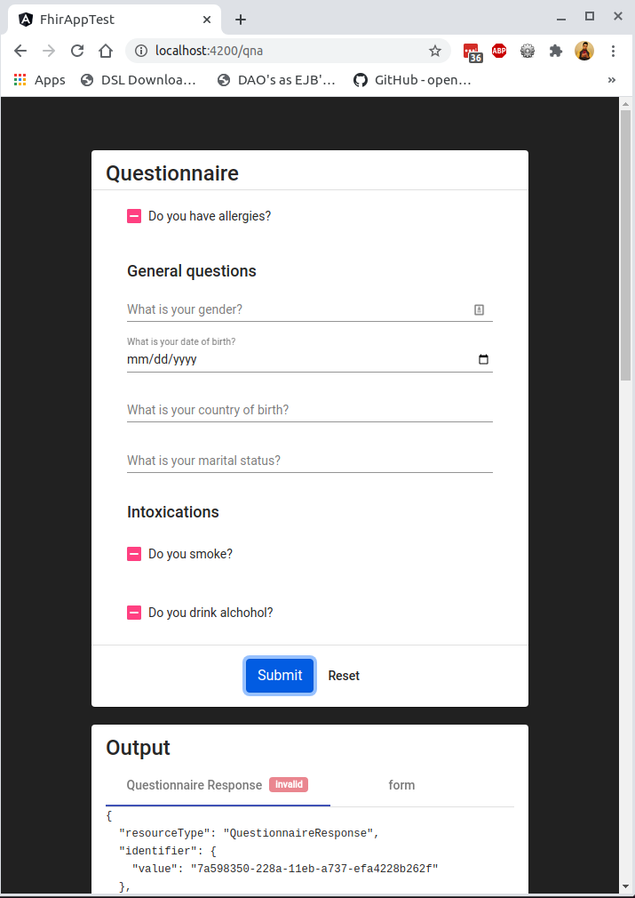

# HAPI FHIR Playground: Basic Test App

This project is a skeleton project for querying data from the [HAPI FHIR public test server](http://hapi.fhir.org/baseR4)

### Getting Started:

* [ ] Take a few minutes to familiarize yourself with the [FHIR Standard](http://hl7.org/fhir/) for health data exchange. In particular you might want to read the [Executive Summary](http://hl7.org/fhir/summary.html) and the [Developer Introduction](http://hl7.org/fhir/overview-dev.html)

* [ ] In addition, take a few minutes to familiarize yourself with [Angular](https://angular.io/docs). Understand the basics of component structures, HTTP calls, and other basics covered in the [Fundamentals](https://angular.io/guide/architecture) section.
  
* [ ] Create your own GitHub project and copy the contents of this repository into your own project (please don't fork this repository)

* [ ] Locate the component `AppComponent` and run it. You should see results pop up in the console of your web browser

* [ ] **Please, do not fork this repo.** Create your own private GitHub repository to do your work in.

### Basic Tasks:

* [ ] Add a table to AppComponent and populate it with results from the `getPatients()` function.

* [ ] Modify the `ApiService` class to include another call that fetches all `Patient` resources whose `birthdate` are between 1960 and 1965 (inclusive).

* [ ] Sort the table based on youngest birthdate to oldest.

* [ ] Time the request. Output the time on the footer of the page. Use a pipe for formatting the output.

* [ ] Add a search function to the page. Add two inputs to `AppComponent` - a textbox that takes in a name (first or last), and a datepicker.  Modify the `ApiService` to include a call that searches for a `Patient` based on the name passed in, and the date of birth passed in from the date picker. The results should be reflected in the table. Use the [SearchParameters section](https://www.hl7.org/fhir/patient.html#search) to help with building your query.

* [ ] Apply validation to the inputs - the name box cannot contain non-alphabetic characters, and the date field must be a valid date structure (YYYY/MM/DD). 

* [ ] Prevent the button search button from multi-clicks wihout using timeouts.

* [ ] Commit your work.

### Intermediate Tasks:

* [X] In `QuestionnaireComponent`, generate a form using the `questionnaire.json` file in the `assests` folder. The form should have validation applied to each input.

* [X] Using the results from the form, generate a [`QuestionnaireResponse`](https://www.hl7.org/fhir/questionnaireresponse.html). The `QuestionnaireResponse` should follow the structure outlined in the [Resource Content Section](https://www.hl7.org/fhir/questionnaireresponse.html#resource)

* [X] Display your results at the bottom of the page.

* [X] Update the `QuestionnaireComponent` to be mobile-friendly.

* [X] Please include unit tests for your work.

* [X] Commit your work.

## Solution

checkout the working app -> [`https://dynamic-questionnaire-fhir.web.app/qna`](https://dynamic-questionnaire-fhir.web.app/qna)



**Complete Questionnaire Response:**
```json
{
  "resourceType": "QuestionnaireResponse",
  "identifier": {
    "value": "a73b3550-229c-11eb-86dd-3f3f88766ce6"
  },
  "questionnaire": "http://hl7.org/fhir/Questionnaire/f201",
  "status": "completed",
  "authored": "2020-11-09T15:02:58.085Z",
  "item": [
    {
      "linkId": "1",
      "text": "Do you have allergies?",
      "answer": [
        {
          "valueBoolean": true
        }
      ]
    },
    {
      "linkId": "2",
      "text": "General questions",
      "item": [
        {
          "linkId": "2.1",
          "text": "What is your gender?",
          "answer": [
            {
              "valueString": "asfsdaf"
            }
          ]
        },
        {
          "linkId": "2.2",
          "text": "What is your date of birth?",
          "answer": [
            {
              "valueDate": "2020-11-18"
            }
          ]
        },
        {
          "linkId": "2.3",
          "text": "What is your country of birth?",
          "answer": [
            {
              "valueString": "asdfsa"
            }
          ]
        },
        {
          "linkId": "2.4",
          "text": "What is your marital status?",
          "answer": [
            {
              "valueString": "asfasdfa"
            }
          ]
        }
      ]
    },
    {
      "linkId": "3",
      "text": "Intoxications",
      "item": [
        {
          "linkId": "3.1",
          "text": "Do you smoke?",
          "answer": [
            {
              "valueBoolean": true
            }
          ]
        },
        {
          "linkId": "3.2",
          "text": "Do you drink alchohol?",
          "answer": [
            {
              "valueBoolean": true
            }
          ]
        }
      ]
    }
  ]
}
```


